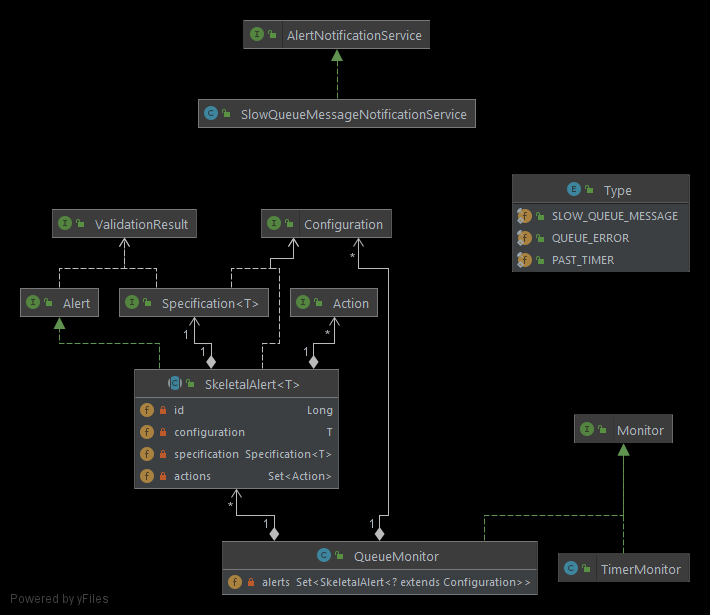
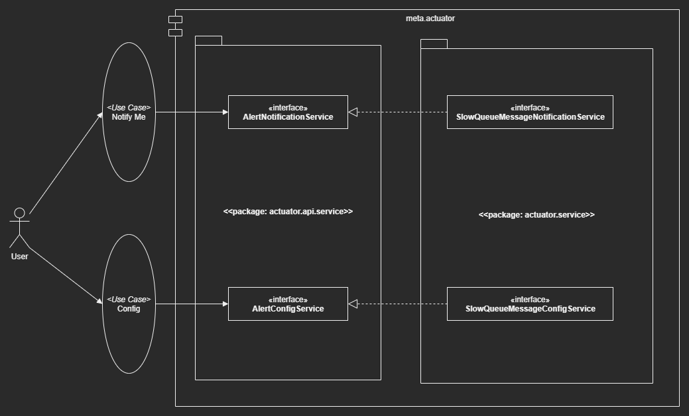
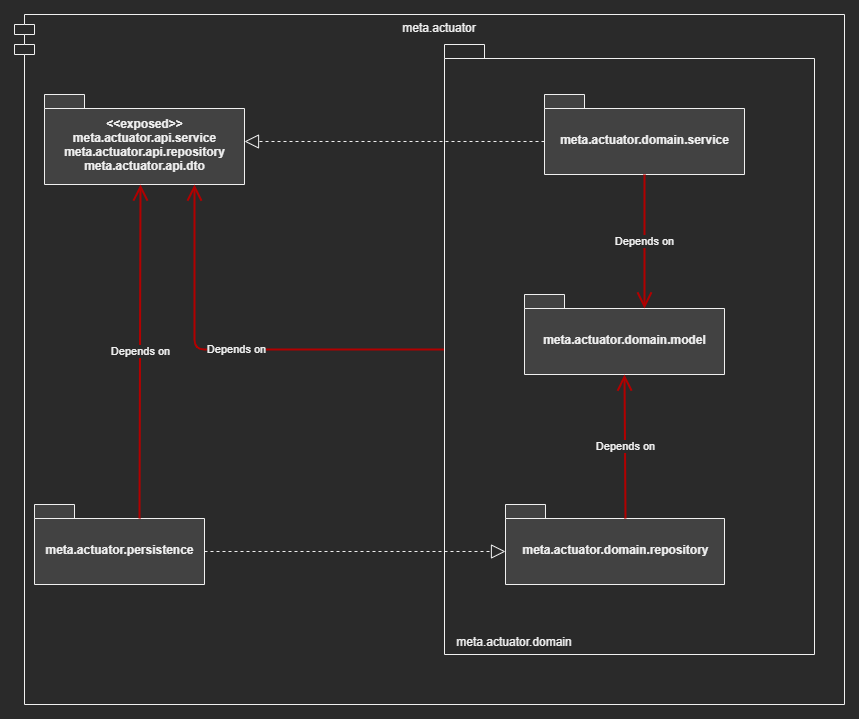
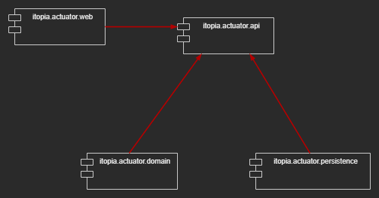

# The Design of ``` tecsys-meta-actuator ```

- In essence, Actuator brings production-ready features to our application
    - Monitoring our app
    - Gathering metrics
    - Understanding traffic
    - The state of our database

- 


- 


- 


- 
